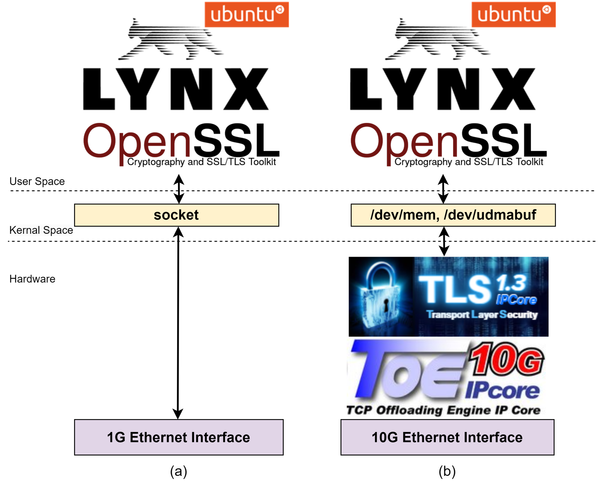

# TLS10GC-IP Reference Design

## Overview
This reference design demonstrates how the TLS10GC-IP offloads encryption and decryption tasks when securely browsing via the Lynx web browser. By making minimal modifications to the OpenSSL library and Lynx application on Ubuntu, users can achieve higher data transfer speeds while maintaining the same user experience.

## System Overview
In secure communication, web browsers typically act as clients that communicate with web servers via the HTTPS protocol. **Lynx**, a text-based web browser, serves as a user application that:

- Handles HTTP protocol
- Utilizes the OpenSSL library for managing TLS connections
- Uses sockets for handling TCP connections and lower network layers

The **OpenSSL** library manages TLS connections by handling the TLS handshake and encrypting and decrypting data packets exchanged during communication. However, this encryption and decryption process is resource-intensive, leading to high CPU utilization. 

For compact edge devices such as the KR260, CPU usage can reach 100% while performing these tasks, affecting the transfer speed of communication. To address this, the design integrates high-performance security and network IP cores, including:

- [**TLS10GC-IP**](https://dgway.com/en/amd/tls-ip.html)
- [**TOE10GLL-IP**](https://dgway.com/Lowlatency-IP_X_E.html#LLTOE10G)
- [**LL10GEMAC-IP**](https://dgway.com/Lowlatency-IP_X_E.html#LL10GEMAC)

These IP cores are implemented in the hardware logic of the KR260 to utilize the 10G Ethernet port efficiently.



## System Components
This demo consists of three main components:

### 1. Hardware
User logic and IP cores for acceleration.
The IP and project are not included in this repository.
Please contact [Design Gateway](https://dgway.com/contact.html) to obtain this free evaluation demo file.

### 2. Kernel Space
Device drivers for interface between hardware and software in user space.
- **`/dev/mem`** – Used for hardware register access  
- **`/dev/udmabuf`** – Used for handling memory  

### 3. User Space
Modified **Lynx** and **OpenSSL** source code to support interfacing with the accelerator hardware.
- **Lynx** – Text-based web browser  
- **OpenSSL** – Cryptographic library for managing TLS connections  

## Getting Started
### Prerequisites
- KR260 hardware platform
- 10G Ethernet connectivity
- Ubuntu OS with Lynx and OpenSSL installed provided by Design Gateway for running on KR260

### Installation Steps
For setting up the microSD card, you’ll need to download the latest SD card image and then write it using an Image Flashing tool.

1. **Download the KR260 image** for the TLS10GC-IP demo from **[Design Gateway](https://dgway.com/contact.html)**.  
2. **Download the [Raspberry Pi Imager](https://www.raspberrypi.com/software/)** (recommended; available for Windows, Linux, and macOS). Additional OS-specific flashing tools are available if needed.  
3. **Follow the instructions** in the imager tool to select and flash the downloaded image onto your microSD card.  


After flashing the provided image to the SD card, boot the KR260 with the card.

**Default login credentials:**
```bash
username: ubuntu 
password: kriakr260
```

### Setting Up the System Environment
After booting, set up the system using the following commands:

1. Unload the default hardware application bitstream.
   ```bash
   sudo xmutil unloadapp
   ```
2. Load the hardware application bitstream named DGTLS10GC.
The DGTLS10GC application includes the hardware accelerators used in this demonstration.
   ```bash
   sudo xmutil loadapp DGTLS10GC
   ```
3.	Load the udmabuf kernel driver and specify the size of the DMA buffer in bytes.
In this demo, udmabuf0 is allocated 1MB to use as Tx Buffer and udmabuf1 is allocated 1MB to use as Rx Buffer.
   ```bash
   sudo insmod /home/ubuntu/udmabuf/u-dma-buf.ko udmabuf0=1048576 udmabuf1=1048576
   ```

## Contact Us
For further information or support, please contact  [Design Gateway](https://dgway.com/contact.html).
